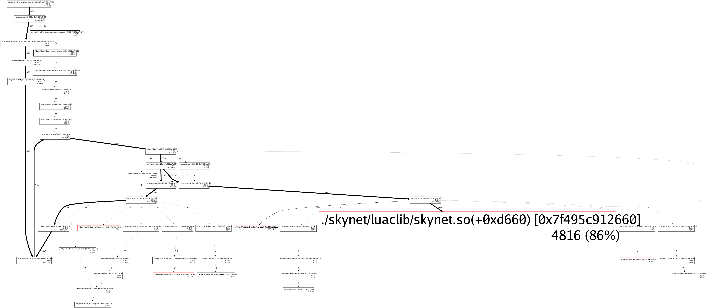

# Skynet-mprof
skynet cmem内存占用统计工具
* What is skynet? https://github.com/cloudwu/skynet

## 注意事项
* 目前只支持全量采样，即所有service每一次内存分配、释放都会统计在内

## 词汇解释
* flat：所有调用链里，该函数为叶节点的统计值总和
* cum：所有调用链里，该函数的统计值总和（叶节点 + 非叶节点）
* inuse space：正在使用中的内存统计，通常用来分析如内存泄漏等原因导致的程序运行时内存占用过高问题
* alloc space: 累计分配过的内存总和，通常用来分析优化程序运行时内存峰值

## 编译 && 运行示例
* 在本地skynet代码仓库根目录执行:git apply [skynet_mprof.diff](https://github.com/xingshuo/skynet-mprof/blob/main/skynet_mprof.diff#L1)，并重新编译skynet
```bash
# make cleanall
# make linux SKYNET_DEFINES=-DMEMORY_PROFILE
```
* 将编译后的skynet仓库连接到工程目录下
```bash
# ln -sf $YOUR_SKYNET_PATH skynet
```
* 编译mprof.so
```bash
# make
```
* 编译解析器mprof
```bash
# go get github.com/goccy/go-graphviz
# go build mprof.go
```
* 运行测试用例
```bash
# ./skynet/skynet test/config
```

## 分析示例采样结果
* 以文本形式查看所有热点函数（叶节点）性能开销占比（降序）
```bash
# ./mprof -i test_mem.pro -top=flat
```
输出示例：<br>
mprof解析器默认展示`inuse`内存信息
```bash
-----------inuse space ranking----------
No:	 Flat:	 Flat%:	 FlatObjs:	 Cum:	 Cum%:	 CumObjs:	 FuncName:
1th	 4.70(kb)	 86.00%	 50	 4.70(kb)	 86.00%	 50	 ./skynet/luaclib/skynet.so(+0xd660) [0x7f495c912660]
2th	 0.70(kb)	 12.86%	 10	 0.70(kb)	 12.86%	 10	 ./skynet/luaclib/skynet.so(+0xd60f) [0x7f495c91260f]
3th	 0.06(kb)	 1.14%	 1	 0.06(kb)	 1.14%	 1	 /lib/x86_64-linux-gnu/libdl.so.2(+0x1c05) [0x7f495cb39c05]
4th	 0(kb)	 0%	 0	 5.47(kb)	 100.00%	 61	 ./skynet/skynet(+0x20f42) [0x55f2da7acf42]
5th	 0(kb)	 0%	 0	 5.47(kb)	 100.00%	 61	 ./skynet/skynet(+0x2085e) [0x55f2da7ac85e]
...
```
采样结果分析：<br>
该示例在test_gate服务的[dispatch_msg](https://github.com/xingshuo/skynet-mprof/blob/main/test/test_gate.lua#L17)处构造了一个内存泄漏的场景<br>
```bash
通过addr2line工具解析下热点函数触发内存分配位置的详细信息:

# addr2line -Cif -e ./skynet/luaclib/skynet.so 0xd660
memcpy
/usr/include/x86_64-linux-gnu/bits/string_fortified.h:34
filter_data_
/home/ubuntu/Repo/github/skynet-mprof/skynet/lualib-src/lua-netpack.c:286
filter_data
/home/ubuntu/Repo/github/skynet-mprof/skynet/lualib-src/lua-netpack.c:311
lfilter
/home/ubuntu/Repo/github/skynet-mprof/skynet/lualib-src/lua-netpack.c:355

# addr2line -Cif -e ./skynet/luaclib/skynet.so 0xd60f
memcpy
/usr/include/x86_64-linux-gnu/bits/string_fortified.h:34
filter_data_
/home/ubuntu/Repo/github/skynet-mprof/skynet/lualib-src/lua-netpack.c:294
filter_data
/home/ubuntu/Repo/github/skynet-mprof/skynet/lualib-src/lua-netpack.c:311
lfilter
/home/ubuntu/Repo/github/skynet-mprof/skynet/lualib-src/lua-netpack.c:355
```
结合具体应用场景，可分析出是这2处代码其上一行的skynet_malloc分配的内存，在test_gate服务处理完消息后，没有被释放导致了内存泄漏
* 生成函数间调用关系及内存分配信息的png/svg图片
```bash
# ./mprof -i test_mem.pro -png test_mem.png
# ./mprof -i test_mem.pro -svg test_mem.svg
```
输出示例：

* 生成采样文件的源信息明细（通常用于调试）
```bash
# ./mprof -i test_mem.pro -info test_mem.txt
```
输出示例：
```bash
# cat test_mem.txt
----------FuncName:------------
./skynet/skynet(+0x12216) [0x55f2da79e216]
./skynet/skynet(+0x1274a) [0x55f2da79e74a]
./skynet/skynet(+0x12986) [0x55f2da79e986]
./skynet/skynet(skynet_context_release+0x37) [0x55f2da79eab7]
./skynet/skynet(skynet_context_message_dispatch+0x92) [0x55f2da79f0f2]
./skynet/skynet(skynet_context_message_dispatch+0x138) [0x55f2da79f198]
./skynet/skynet(skynet_send+0x67) [0x55f2da79f377]
./skynet/skynet(+0x1354f) [0x55f2da79f54f]
./skynet/skynet(+0x135ff) [0x55f2da79f5ff]
./skynet/skynet(skynet_sendname+0x152) [0x55f2da79f762]
./skynet/skynet(+0x1395b) [0x55f2da79f95b]
./skynet/skynet(skynet_timeout+0x48) [0x55f2da7a0338]
./skynet/skynet(skynet_error+0x10a) [0x55f2da7a0aba]
./skynet/skynet(skynet_strdup+0x1f) [0x55f2da7a72ff]
...
--------------------------------------------------------------------
AllocBytes:	FreeBytes:	AllocObjs:	FreeObjs:	Backtrace:
2400      	0        	25       	0       	0x7f495cc95609 -> 0x55f2da79f95b -> 0x55f2da79f0f2 -> 0x55f2da79e216 -> 0x7f495c90aafc -> 0x55f2da7a969e -> 0x55f2da7acf42 -> 0x55f2da7abb15 -> 0x55f2da7acbf4 -> 0x55f2da7baf48 -> 0x55f2da7ac85e -> 0x55f2da7c5f35 -> 0x55f2da7a969e -> 0x55f2da7acf42 -> 0x55f2da7abb15 -> 0x55f2da7acbf4 -> 0x55f2da7baedf -> 0x55f2da7ac5b3 -> 0x7f495c912660
1456      	0        	13       	0       	0x7f495cc95609 -> 0x55f2da79f95b -> 0x55f2da79f0f2 -> 0x55f2da79e216 -> 0x7f495c90aafc -> 0x55f2da7a969e -> 0x55f2da7acf42 -> 0x55f2da7abb15 -> 0x55f2da7acbf4 -> 0x55f2da7baf48 -> 0x55f2da7ac85e -> 0x55f2da7c5f35 -> 0x55f2da7a969e -> 0x55f2da7acf42 -> 0x55f2da7abb15 -> 0x55f2da7acbf4 -> 0x55f2da7baedf -> 0x55f2da7ac5b3 -> 0x7f495c912660
960       	0        	12       	0       	0x7f495cc95609 -> 0x55f2da79f95b -> 0x55f2da79f0f2 -> 0x55f2da79e216 -> 0x7f495c90aafc -> 0x55f2da7a969e -> 0x55f2da7acf42 -> 0x55f2da7abb15 -> 0x55f2da7acbf4 -> 0x55f2da7baf48 -> 0x55f2da7ac85e -> 0x55f2da7c5f35 -> 0x55f2da7a969e -> 0x55f2da7acf42 -> 0x55f2da7abb15 -> 0x55f2da7acbf4 -> 0x55f2da7baedf -> 0x55f2da7ac5b3 -> 0x7f495c912660
...
```

## 参考
* https://github.com/golang/go/blob/master/src/runtime/mprof.go
* https://github.com/google/pprof